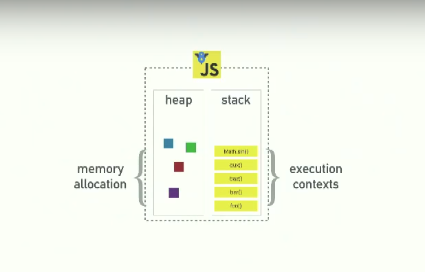
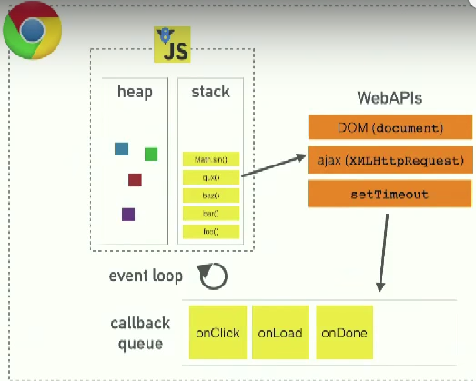
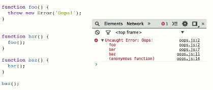
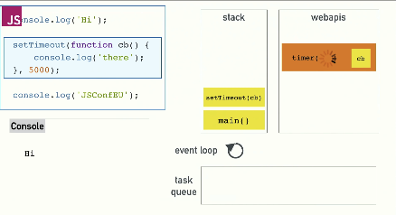

# Event Loop
*Not actually from the course, but somewhat relevant so figured I'd take notes 
here*

http://latentflip.com/loupe

## Background
JavaScript is a single-threaded non-blocking asynchronous concurrent language. 
It has a call stack, an event loop, a callback queue, and other APIs.



There's a heap where memory allocation happens. There's a call stack.

If you look through the V8 codebase for typical browser things like setTimeout
or DOM or xmlhttprequest, they're not in there.



## The Call Stack
JS has one call stack. It can do one thing at a time.

Let's imagine we have this code:
```js
  function multiply(a, b) {
    return a * b;
  }

  function square(n) {
    return multiply(n, n);
  }

  function printSquare(n) {
    var squared = square(n);

    console.log(squared);
  }

  printSquare(4);
```
The call stack is a data structure that records where in the program we are.
If we step into a function, we push it onto the stack. If we return from the 
function, then we pop it off.

In our call stack, here's what happens:
1. We run the code. `Main()` gets called. It gets pushed onto our call stack.
2. There's some function definitions.
3. `printSquare` gets invoked, so we push it on top of our call stack.
4. `printSquare` invokes `square`, so we push `square` on top of our call stack.
5. `square` invokes `multiply`, so we push `multiply` on top of our call stack.
6. `multiply` executes, and it returns, so we pop it off.
7. `square` returns, we pop it off.
8. `console.log` executes and returns, so that gets pushed on and then popped off.
9. `printSquare` implicitly returns since it's done executing.

Browsers print the stack trace whenever there's an error:



### Blocking (What happens when things are slow?)
Image processing is slow; network requests are slow.

Imagine if network requests were synchronous:
```js
var foo = $.getSync('//foo.com');
var bar = $.getSync('//bar.com');
var quz = $.getSync('//qux.com');

console.log(foo);
console.log(bar);
console.log(qux);
```
The synchronous calls would block that call stack. You can't move onto anything
else until the call is finished. The browser is locked up.

The solution? Asynchronous callbacks.

```js
  console.log('hi');
  setTimeout(function() {
    console.log('there');
  }, 5000);

  console.log('JSConfEU');
```
In our callstack:
1. It console.logs 'hi' so it gets pushed on and popped off right away.
2. setTimeout is called, so it gets pushed onto the stack. console.log hi can't
happen for another 5 seconds, so that somehow disappears from the callstack.
3. 'JSConfEU' gets console logged, and then about 5 seconds later, 'there' gets
logged.

How does that happen?

## Concurrency and the Event Loop
The reason we can do things concurrently is because the browser is more than 
just the JavaScript runtime:


In Node, the diagram looks basically identical, except instead of the WebAPIs, 
we have C++ APIs.

Essentially, what happened previously when we called setTimeout was that 
setTimeout is actually an API provided by the web. It's not part of the V8 engine.

So when we executed it, setTimeout called and popped off the call stack, while
the actual timer goes to the WebAPI to wait:



Any of the WebAPIs, when they're done, they push your callback onto the task
queue.

The Event Loop has one job: to look at the call stack and look at the task 
queue. **If the stack is empty**, it takes the first thing on the queue and 
pushes it onto the callstack, which effectively runs it.

That's why even with this code:

```js
  console.log('hi');
  setTimeout(function cb(){
    console.log('there');
  }, 0);

  console.log('JSConfEU');
```
It will still log 'JSConfEU' before 'there' even though it has a timer of 0.

Because `console.log('there')` will get sent to the WebAPI, execute immediately,
and then get pushed into the task queue. However, the event loop won't push 
items from the task queue onto the call stack unless the stack is empty. 