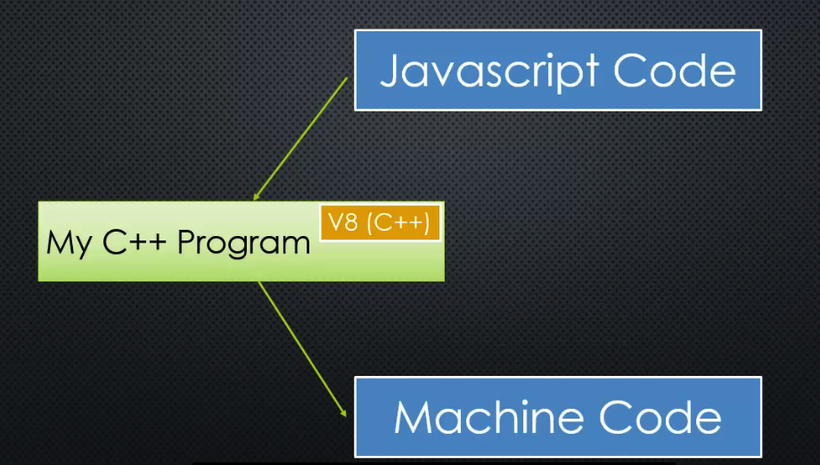

# JavaScript Engine

## Command Line Interface (CLI)
Utility to type commands to your computer rather than clicking.

Bash: Linux
Terminal: Mac
Command Prompt: Windows

## Conceptual Aside
* Processors
    * Microprocessor is a tiny machine.
    * Not all microprocessors are the same (not all speak the same instructions)
* Machine Code
    * Programming languages spoken by computer processors
      * IA-32
      * x86-64
      * ARM
      * MIPS
    * Every program you run on your computer has been converted (compiled) into machine code.
    * Level of Abstraction
      * Machine Language
      * Assembly Language
      * C/C++
      * Javascript (very far removed from processor)
* C++
    * Node is written in C++
    * V8 is written in C++
      * V8 is the engine that converts Javascript into machine language

## ECMAScript
The Standard JavaScript is based on. We needed a standard because there are many engines out there.

## JavaScript Engine
A program that converts the JavaScript code into something that the computer processor can understand. It should follow the ECMAScript standard on how the language should work and what features it should have.

## V8 Under the Hood
Open-sourced engine built by Google. Highly performant. Really interesting high-level overview:
https://www.google.com/googlebooks/chrome/small_12.html

Key feature of V8: adding features to JavaScript
V8 can run standalone or embedded into any C++ application.

In other words, you can embed V8 into a C++ program that you write that
converts JavaScript to Machine code:

This allows you to add more features than what the ECMA standards call
for. This is powerful because JavaScript was designed for the browser. It
wasn't designed to do lower level things like handling files/folders that
live in your hard drive or connecting to databases. Now, I can make anything
that I do with C++ available to my JavaScript code.

That's essentially what Node.js is: it's a C++ program with V8 embedded
that has added a wealth of great features that make it suitable to be
a server technology.
