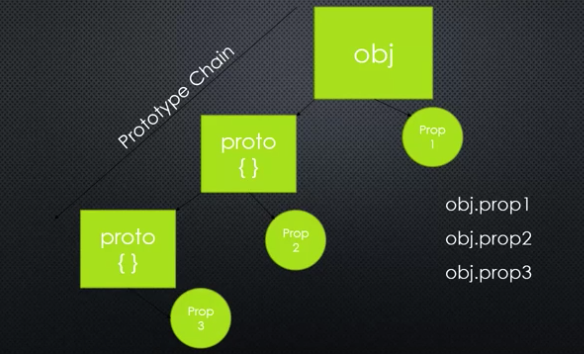
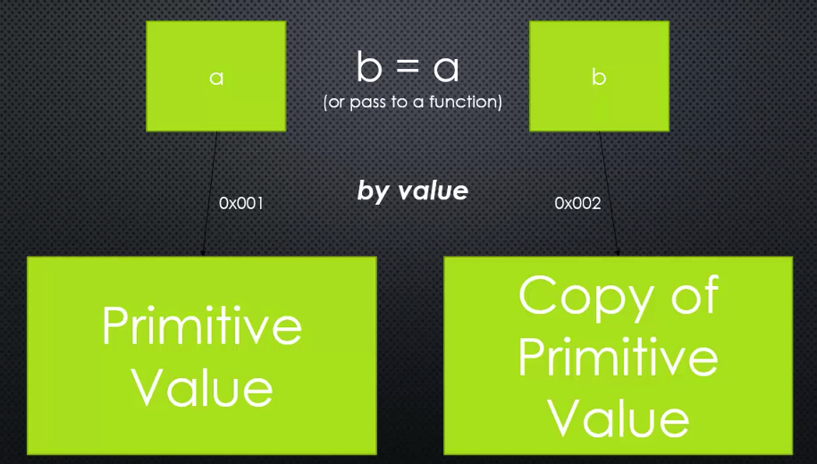
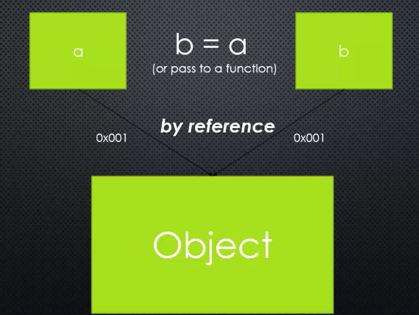

# The Node Core

## Server vs. Client
Node.js is a server technology. A server is a computer that is performing
services. The client asks for those services. The server performs those services
and then gives the response.

DOM Manipulation, XML HTTP Request, and other features that you use
on the browser are not in the ECMA script standards, but they're made
available by the browser. Google chrome is just a C++ app that embeds
the V8 engine. Chrome the browser is the one that's giving more features.

The goal with Node.js is to also use JavaScript on the server side.
This allows you to share libraries of code between server and client side.

## What does JavaSCript need to manage a server?
* JS needs better ways to organize our code into reusable pieces.
* Ways to deal with files
* ways to deal with databases
* The ability to communicate over the Internet
* The ability to accept requests and send repsponses (in the standard format)
* A way to deal with work that takes a long time.

## The JS code
Most of them are wrappers for the C++ code, but there are parts that are
not and simply add more functionality for you.

## Modules
A reusable block of code whose existence does not accidentally impact
other code.

CommonJS Modules: An agreed upon standard for how code modules should be
structured.

The `require` function is made available by Node.

## First-class functions and function expressions
First-class functions: everything you can do with other types, you can
do with functions. In other words, you can use functions like strings,
ints, etc. (ie. pass them around, set variables equal to them, put them
in arrays, and more.)

More specifically, this means that JS supports constructing new functions
during the execution of a program, storing them in data structures,
passing them as arguments to other functions, and returning them as the
values of other functions.


Expression: a block of code that results in a value.
Example of function expression:

```js
var greetMe = function() {
  console.log('Hi Tony');
};
```

The above is different from a named function (ie. `function greetMe {}`).

Personal aside: This is part of the reason I like JS so much. When you
have control over the execution of functions by having first-class
functions, it gives you so much more flexibility with functions.

## Objects
When a function is attached to an object, we call that a method.

Object literal: name/value pairs separated by commas and  surrounded by curly
braces.

## Prototypal Inheritance and Function Constructors
Inheritance: one object gets access to the properties and methods of another 
object.



2 objects can share the same prototype chain.

Function constructors: a normal function that is used to construct objects.

The 'this' variable points to a new empty object, and that object is returned
from the function automatically.

```js
function Person(firstname, lastname) {
  // when I used the new key word, the 'this' keyword will point to a new
  // object that I can attach these attributes to.
  this.firstname = firstname;
  this.lastname = lastname;
}

// Here I have a greet function on the prototype. What happens when you use a 
// function constructor is that any object created from the function constructor,
// its prototype will point to the prototype property of the function you used
// to create the object.
Person.prototype.greet = function() {
  console.log('Hello, ' + this.firstname + ' ' + this.lastname); 
}

var john = new Person('John', 'Doe');
var jane = new Person('Jane', 'Doe');

john.__proto__ == jane.__proto__ 
// true
```
Functions are special types of objects, so I can have properties and methods 
on functions as well. And there's a built in one called prototype that's 
just an object, but I can attach properties and methods to this prototype object.

There's a special `__proto__` method that lets me see what the actual 
prototype object is of an object that I'm working with.

## By Reference and By Value
Primitive: type of data that represents a single value; not an object.

Here, if we have a variable a, and we pass it into a function that accepts a 
variable b, it's pass by value:


```js
function change(b) {
  b = 2;
}

var a = 1;
change(a);
console.log(a);
// a is still 1;
// The above is pass by value because a copy of the primitive value gets 
// passed into the function.
```

Objects, unlike primitives, are passed by reference:


```js
function changeObj(d) {
  d.prop1 = function() {};
  d.prop2 = {};
}

var c = {};
c.prop1 = {};
console.log(c);
// c is now { prop1: function() {}, prop2: {}};
```
Node.js takes advantage of how objects are passed by reference in regards to
how require and module.exports works.

